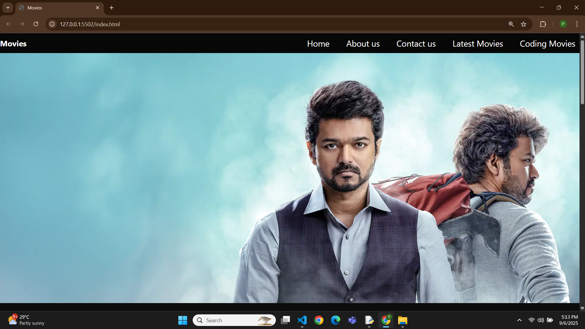

# 🎬 Movies Website

A simple **HTML & CSS** project that showcases a movie-themed landing page with **latest movies, trending trailers, and a watchlist section**.
This project is designed to practice web layout, media embedding, and styling.      
 
---  
## 🚀 Features
- 🖼️ **Hero section** with a banner image          
- 🎞️ **Latest Movies** marquee with scrolling posters 
- 📺 **Trending Movies** with embedded YouTube trailers   
- ✅ **Watch List** section with static movie posters        
- 🎨 Clean and dark-themed UI for a cinematic feel
  
---                          

## 📸 Screenshot
                                                                                                      

---

## 🎥 Demo
Watch the demo video here:  
[▶️ Click to Watch Demo](demo.mp4)

---

## 🛠️ Tech Stack
- **HTML5** – Structure of the website 
- **CSS3** – Styling and layout  

---

